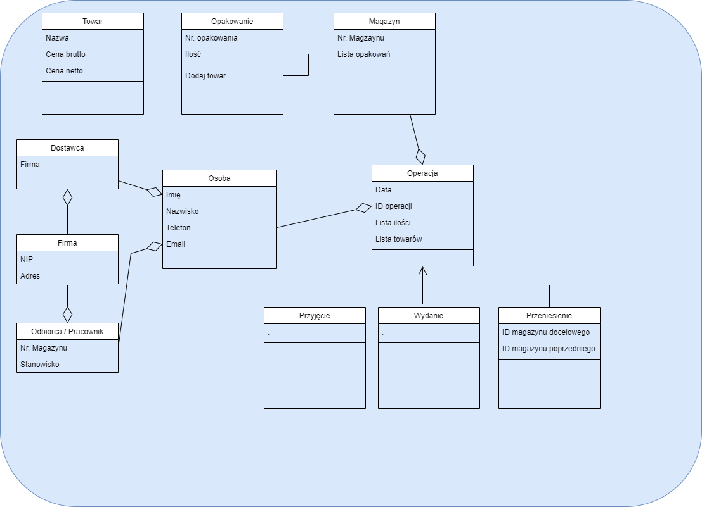

# **_Opis Projektu oraz wymagania_**

## **_Opis aplikacji_**

Celem tego projektu jest utworzenie aplikacji, używając języka Python, pozwalającej na utrzymanie porządku w magazynach, na przykład magazynie części
elektronicznych lub nawet we własnym pokoju, po wcześniejszym oznaczeniu półek/szafek. Musi ona pozwalać na łatwe dodawanie, odejmowanie towarów do danych magazynów, oraz także pozwalać na podgląd stanu magazynu z możliwym wydrukiem do pdf. 
aktualnego stanu magazynu / magazynów.

## **_ Wymagania _**
- Tworzenie / usuwanie przestrzeni magazynowej (półek, szafek, regałów)
- Tworzenie / usuwanie przedmiotów magazyowanych (towarów)
- Dodawanie / wyciąganie przedmiotów z magazyów oraz przenoszenie ich pomiędzy magazynami
- Dodawanie oraz usuwanie użytkowników oraz możliwy podział na role (admin - magazynier itd.)
- Wyszukiwanie części w magazynie oraz podgląd stanu na żywo.

### **_ Możliwy późniejszy rozwój o _**

- Wydruk przyjęć / wydań oraz stanu magazynu
- Baza firm dostarczających towar i pracowników odbierających towar

## **_Interfejs (render)_**

## **_ Wstępny diagram klas _**

